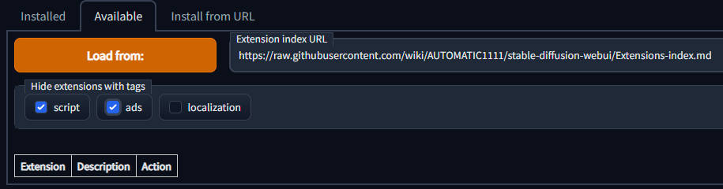
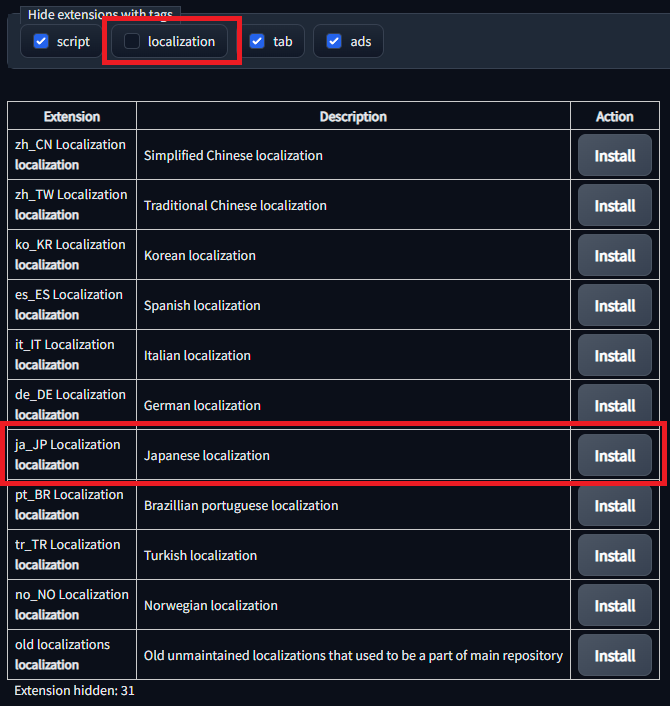
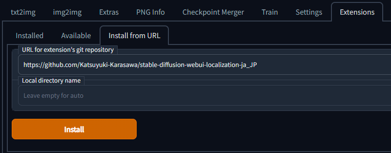
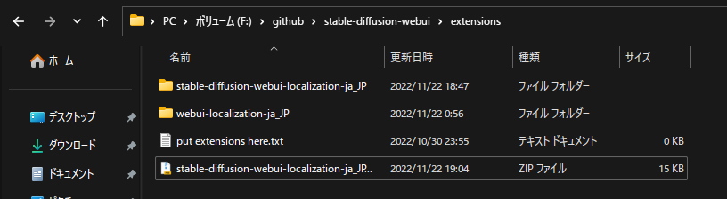
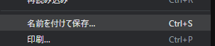
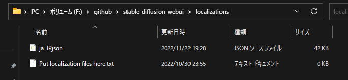
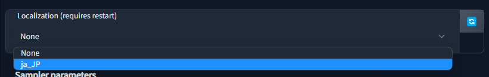

# SD web UI 日本語化プロジェクト
[](https://github.com/AUTOMATIC1111/stable-diffusion-webui/commit/085427de0efc9e9e7a6e9a5aebc6b5a69f0365e7)
[](https://crowdin.com/project/stable-diffusion-webui-localization-ja_JP)

## これはなに
日本語訳用の言語ファイルです。 [AUTOMATIC1111版Stable Diffusion web UI](https://github.com/AUTOMATIC1111/stable-diffusion-webui)で使用します。

## インストール方法

### 1. 公式の拡張機能リストからインストール(最も推奨)
1. `Extensions`タブをクリックし、`Available`をクリックします。
2. `Extension index URL`が以下のURLであることを確認したら`Load From:`をクリックします。

```
https://raw.githubusercontent.com/wiki/AUTOMATIC1111/stable-diffusion-webui/Extensions-index.md
```
3. 読込まれたことが確認できたら、`Hide extensions with tags`を`localization`**以外**にチェックマークを付けます。(`localization`にはつけません)
4. 各言語が出てきますので、`ja_JP Localization`の項目の`Install`をクリックします。

5. `Installed into...`と表示されたら、[利用方法](#利用方法)へ移動してください。


### 2. 拡張機能のリポジトリのURLからインストール(推奨)
1. `Extensions`タブをクリックし、`URL for extension's git repository`のテキストボックスに以下のURLをペーストします。
```
https://github.com/Katsuyuki-Karasawa/stable-diffusion-webui-localization-ja_JP
```
2. `Install`をクリックします。
3. `Installed into...`と表示されたら、[利用方法](#利用方法)へ移動してください。



### 3. ローカルでインストール(推奨)
1. [zipファイル](https://github.com/Katsuyuki-Karasawa/stable-diffusion-webui-localization-ja_JP/archive/refs/heads/main.zip)をダウンロードします。
2. ダウンロードしたzipを`stable-diffusion-webui`以下の`extensions`に移動させます。

3. zipファイルを右クリックして、**すべて展開**します。
4. 展開されたことが確認できたら、[利用方法](#利用方法)へ移動してください。

### 4. ローカルでインストール(非推奨)
**この手順はWeb UIからのアップデートができません。**  
**また、この手順はアップデートにて廃止される可能性があるためご注意ください。**
1. [jsonファイル](https://raw.githubusercontent.com/Katsuyuki-Karasawa/stable-diffusion-webui-localization-ja_JP/main/localizations/ja_JP.json)にアクセスする。
2. 右クリックから`名前を付けて保存...`、もしくは`Ctrl+S`で保存します。

3. 保存先は`stable-diffusion-webui`以下の`localizations`です。

4. 保存されたことを確認したら、[利用方法](#利用方法)へ移動してください。


## 利用方法
### 日本語化ファイルを読み込む
1. `Settings`タブへ移動します。
2. `Settings`タブから`Localization (requires restart)`の項目を探します。

3. ドロップダウンリストから`ja-JP`を選択します。(もし、出てこない場合は右側の🔄から再読込してください。)

### 設定を適用する
1. ページ上部のオレンジ色のボタン(*Apply settings*)をクリックして設定を保存します。

2. ページ下部のオレンジ色のボタン(*Restart Gradio and Refresh components*)をクリックして、web UIを再起動します。


## 翻訳がおかしい/翻訳を手伝う
### [Crowdin](https://crwd.in/stable-diffusion-webui-localization-ja_JP)から翻訳ができます!
気軽に[issue](https://github.com/Katsuyuki-Karasawa/stable-diffusion-webui-localization-ja_JP/issues)を投げましょう!  
分からないことがあれば[Disscussions](https://github.com/Katsuyuki-Karasawa/stable-diffusion-webui-localization-ja_JP/discussions)へどうぞ!  